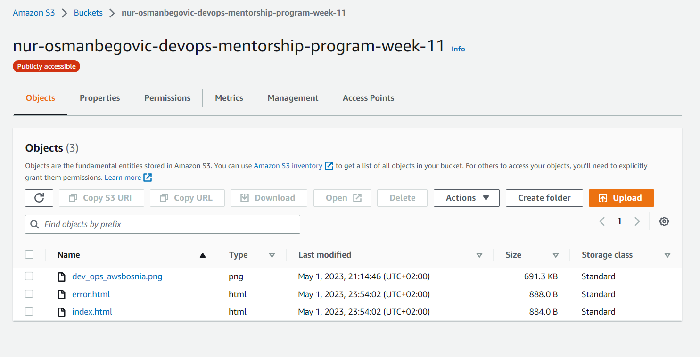
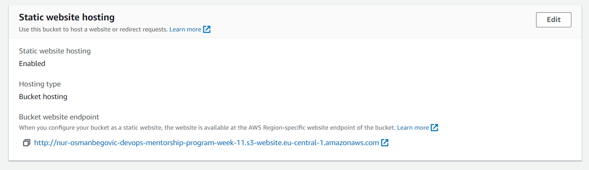
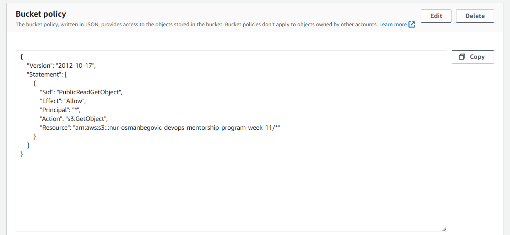
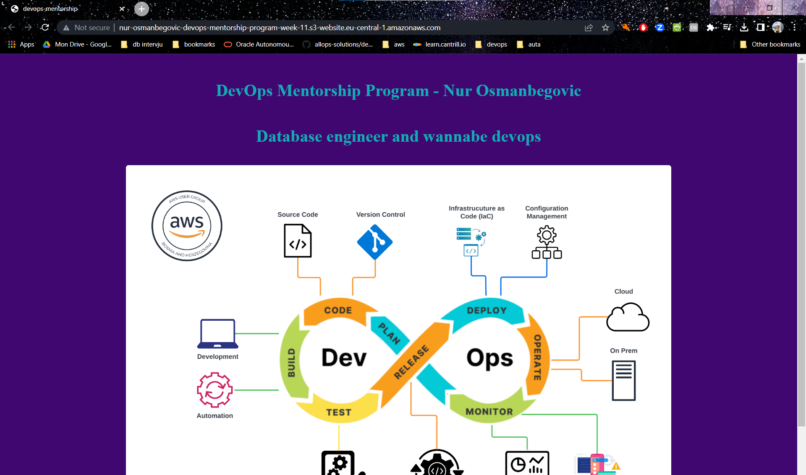
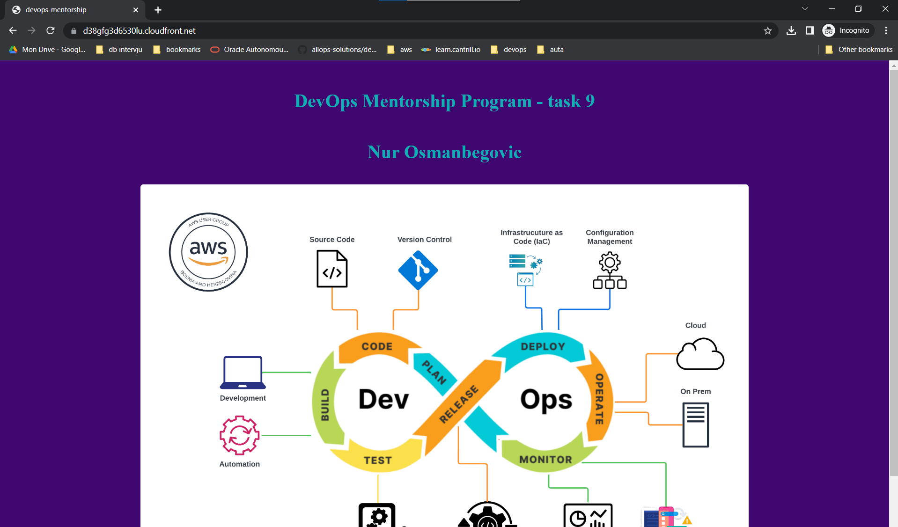
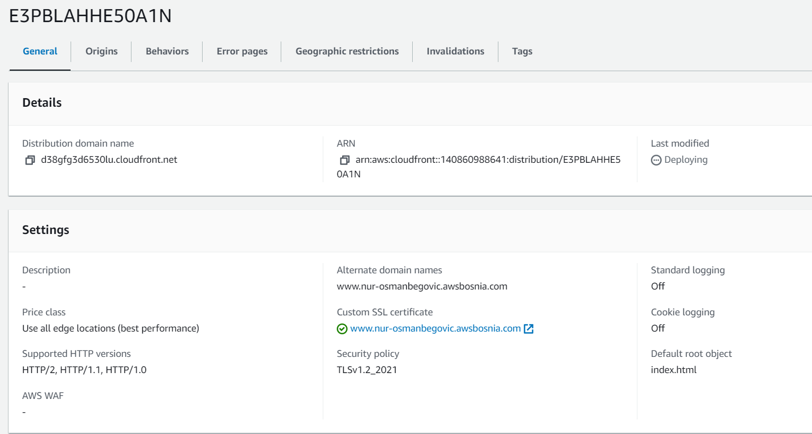
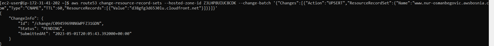

# TASK-8: Autoscaling Group and Load Balancer

#### Potrebno je kreirati S3 bucket u formatu: ime-prezime-devops-mentorship-program-week-11, te omogućiti static website

####  objaviti tu statičku web stranicu kroz CloudFront distribuciju

  
  

#### Kada se završi kreacija distribucije napraviti record unutar Route 53 ( www.ime-prezime.awsbosnia.com) koji će pokazivati na tu distribuciju.
 