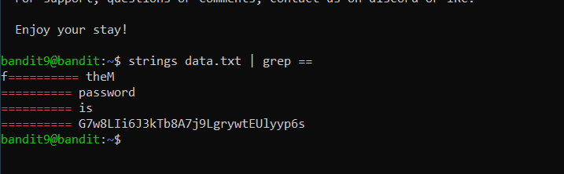
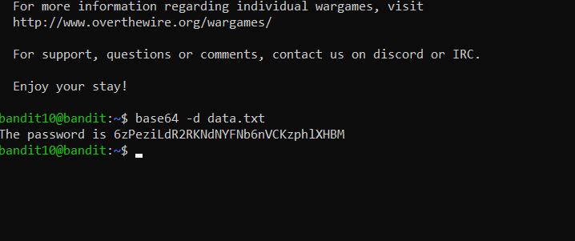

# Bandit wargame

## Task 1

### Exercise   
The goal of this level is for you to log into the game using SSH. The host to which you need to connect is bandit.labs.overthewire.org, on port 2220. The username is bandit0 and the password is bandit0. Once logged in, go to the Level 1 page to find out how to beat Level 1.

### Solution   

ssh user@host -p port is used to connect to a host through ssh on a specific port.

## Task 2

### Exercise   
The password for the next level is stored in a file called readme located in the home directory. Use this password to log into bandit1 using SSH. Whenever you find a password for a level, use SSH (on port 2220) to log into that level and continue the game.

### Solution   

pwd is used to print the workind directory (to check where we are in the file system)
ls is used to list the files in the current directory
cat is used to print the content of a file

## Task 3

### Exercise   
The password for the next level is stored in a file called - located in the home directory

### Solution   

specifying the path to the file with the cat command can solve the problem since cat - cannot work (./ is the path since we are in the home directory and with ls we saw that the file was there)

## Task 4

### Exercise   
The password for the next level is stored in a file called spaces in this filename located in the home directory

### Solution   

using double quotes to specify the filename send as an argument to the cat command will solve the problem of spaces in the file name

## Task 5

### Exercise   
The password for the next level is stored in a hidden file in the inhere directory.

### Solution   

the a flag can be sent to ls command to see the hidden files, but cat can be used on them without a problem

## Task 6

### Exercise   
The password for the next level is stored in the only human-readable file in the inhere directory. Tip: if your terminal is messed up, try the “reset” command.

### Solution   

The file command can be used to see the type of a file, file * show all the files in the directory with their type, the problem was because the file names start with -, so specifying the path to the file command was the solution.

## Task 7

### Exercise   
The password for the next level is stored in a file somewhere under the inhere directory and has all of the following properties:

human-readable
1033 bytes in size
not executable

### Solution   

ll -R list the names of the files in the current directory and all subdirectories along with the permissions, date, time and size

we can use the du command that is used to get disk usage information, a flag is used for all (like recursively, to not have to go through every directory and run the command), the b flag specify that we want the size in bytes. 
Only one file is returned, but with the ll command we can check the permissions and since no x if specified, we can see that it is not executable, and with the file command we can check the file type. 

## Task 8

### Exercise   

The password for the next level is stored somewhere on the server and has all of the following properties:

owned by user bandit7
owned by group bandit6
33 bytes in size

### Solution   

we can use the find command with the given options: -type f for file, -user bandi7, -group bandit6 and 33c to specify the size in bytes
as we can see, we are not able to see a lot of files due to permission issues, but we can fix that with 2>/dev/null to hide the error messages since it is used to supress stderr

## Task 9

### Exercise   
The password for the next level is stored in the file data.txt next to the word millionth

### Solution   

we can use grep and the word millionth to find the line in which the password is, and cat to display it

## Task 10

### Exercise   
The password for the next level is stored in the file data.txt and is the only line of text that occurs only once

### Solution   

The uniq command can be used, but since it compares only following lines, the sort command need to be used first, the u option will show only the lines that appear once

## Task 11

### Exercise   
The password for the next level is stored in the file data.txt in one of the few human-readable strings, preceded by several ‘=’ characters.

### Solution   

strings command is used to return the string characters into files, it focuses on determining the contents of and extracting text from the binary files (non-text file).
we can the use grep with == signs to find the password

## Task 12

### Exercise   
The password for the next level is stored in the file data.txt, which contains base64 encoded data

### Solution   

the base64 command can be used to encode or decode in base64 (we use -d to specify decoding), the file can be sent to the command as a parameter
