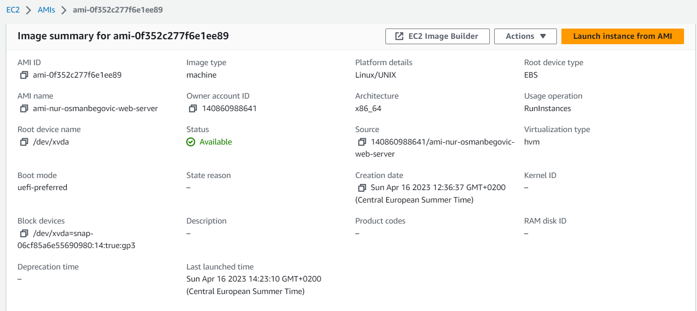
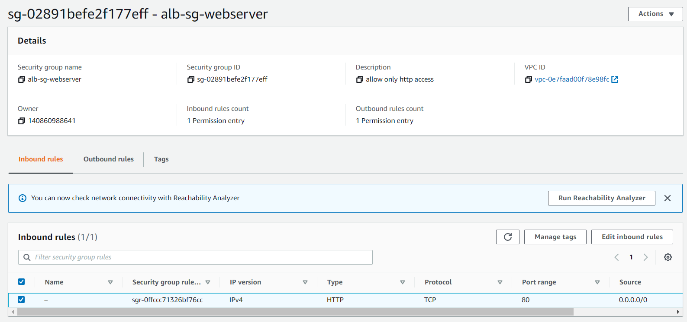

# TASK-7: Autoscaling Group and Load Balancer

#### Link na DNS record:  
http://alb-web-servers-2020198052.eu-central-1.elb.amazonaws.com/

#### Kreirajte AMI image od instance ec2-ime-prezime-web-server, AMI image nazovite ami-ime-prezime-web-server  
  

#### Kreirajte Application Load Balancer pod nazivom alb-web-servers koji ce da bude povezan sa Target Group tg-web-servers  
  
  

#### Kreirajte Auto Scaling group sa MIN 2 i MAX 4 instance. Tip instance koji cete koristiti unutar ASG je t2.micro ili t3.micro gdje cete koristiti alb-web-servers Load Balancer  
  

#### Voditite racuna da security grups koje budete koristili nakon sto zavrsite sa zadatakom dozvoljavaju namanje potrebne otvorene portove  
   
   

#### Kreirajte free account na draw.io ili lucidchart.com stranicama i napravite dijagram infrastrukture iz ovog onako kako je vi vidite/razumijete.  
 

#### Pokusajte simulirati CPU load  
 
