# TASK-8: Autoscaling Group and Load Balancer

#### Od AMI image ec2-ime-prezime-web-server napravite novu EC2 instancu ec2-ime-prezime-task-8  
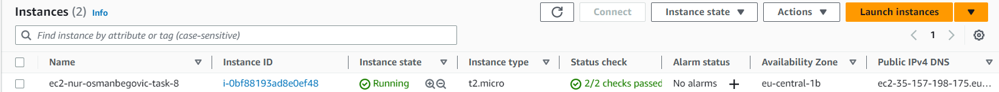

####  Kreirati DNS record <ime>-<prezime>.awsbosnia.com za Hosted Zone awsbosnia.com (Hosted zone ID: Z3LHP8UIUC8CDK) koji ce da pokazuje na EC2 instancu koju ste krairali. Kada ste dodali novi DNS record njegov Name i Value ispiste uz pomoc komande aws route53 list-hosted-zones i alata jq gdje cete prikazati samo Name i Value za DNS record koji ste vi kreirali odnosno za vase domensko ime.

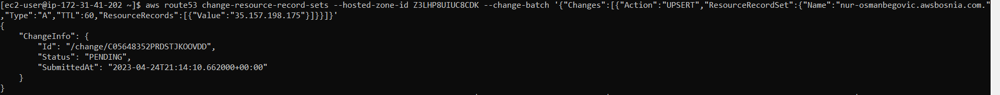  
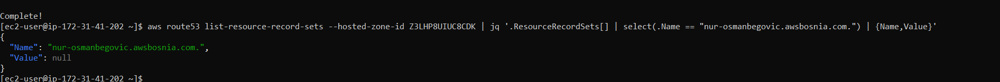  

#### Na EC2 instanci ec2-ime-prezime-task-8 kreirati Let's Encrypt SSL certifikat za vasu domenu. Neophodno je omoguciti da se nodejs aplikaciji moze pristupiti preko linka https://<ime>-<prezime>.awsbosnia.com, to verifikujte skrinsotom gdje se vidi validan certifikat u browseru. 
  

#### Omoguciti autorenewal SSL certifikata. Koristeci openssl komande prikazati koji SSL certitikat koristite i datum njegovog isteka. Probajte korisitit razlicite openssl komande
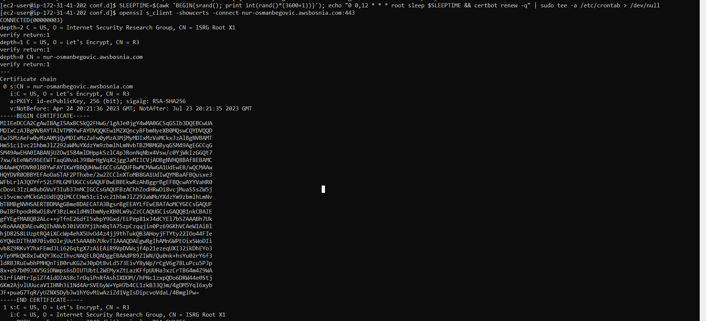  

#### Importujte Lets Encrypt SSL certifikat unutar AWS Certified Managera.
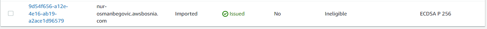  

####  Kreirajte Load Balancer gdje cete na nivou Load Balancera da koristite SSL cert koji ste ranije importovali. (Hint: NGINX config je nophodno auzrirati). Load Balancer u pozadini koristi EC2 instancu ec2-ime-prezime-task-8, nije potrebno kreirati ASG.
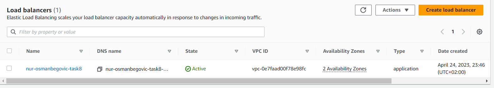 

#### Koristeci openssl komande prikazati koji SSL certitikat koristite za vasu domenu i datum njegovog isteka
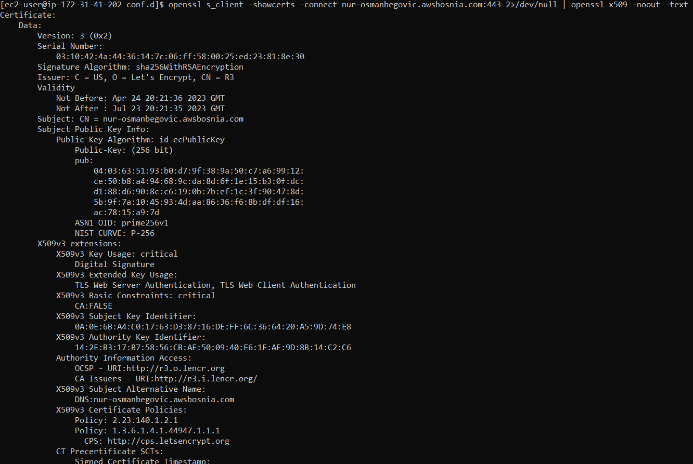 

####  Kreirajte novi SSL certifikat unutar AWS Certified Managera, azurirajte ALB da koristi novi SSL cert koji ste kreirali.
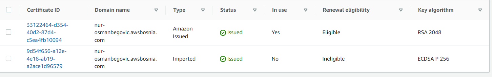 
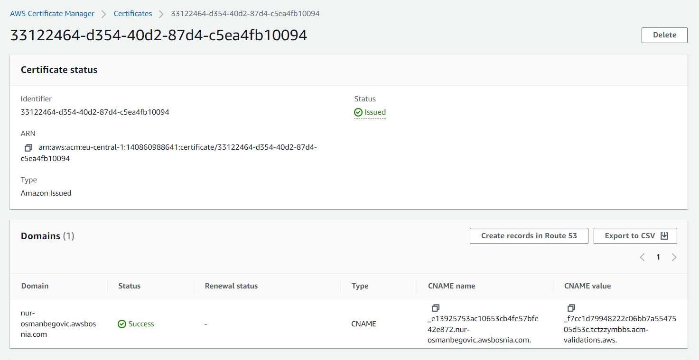 

#### Koristeci openssl komande prikazati koji SSL certitikat koristite za vasu domenu i datum njegovog isteka.
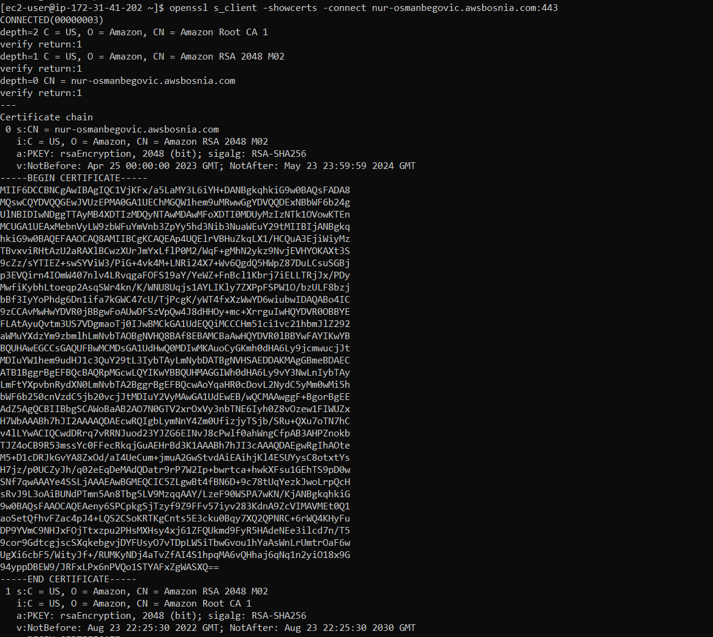 
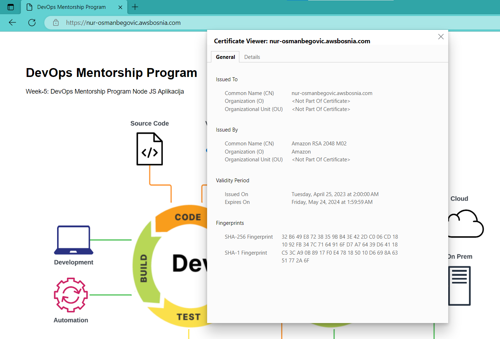 

####  Kada zavrsite sa taskom kreirajte AMI image pod nazivom ami-ec2-ime-prezime-task-8 i terminirajte resurse koje ste koristili za izradu taska.
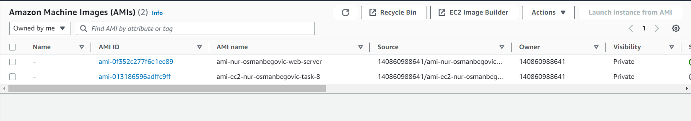 
